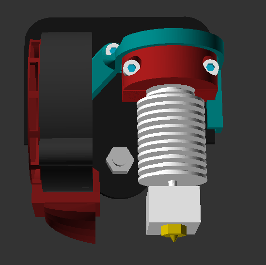
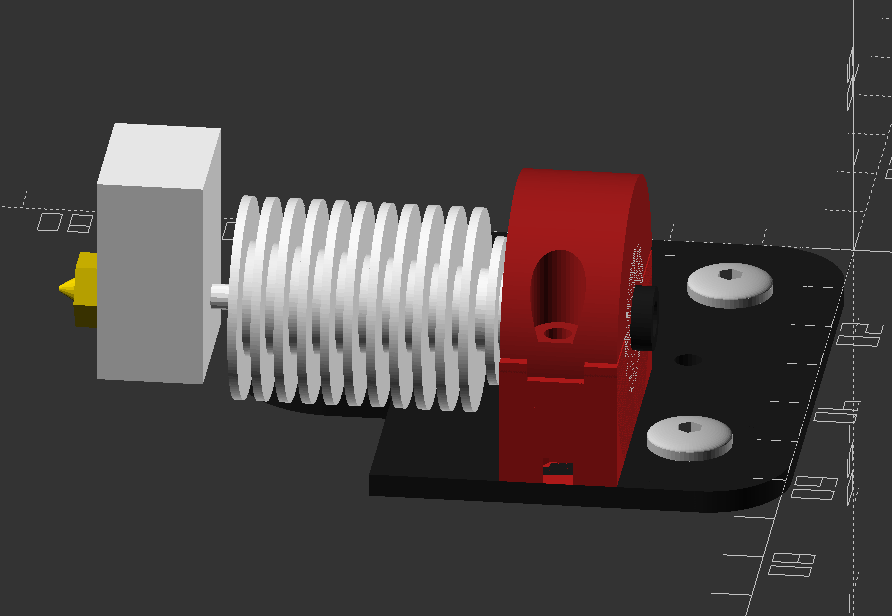
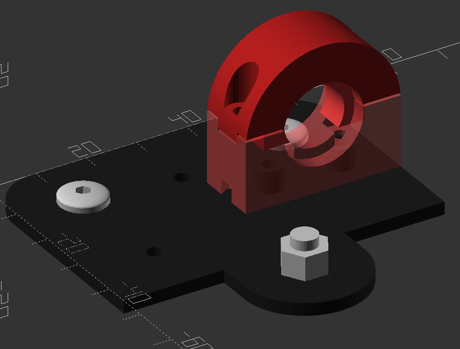
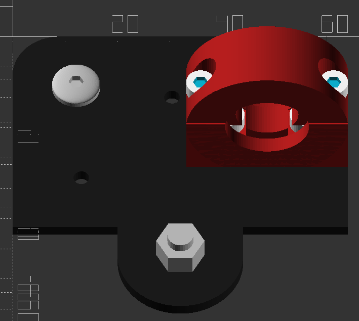
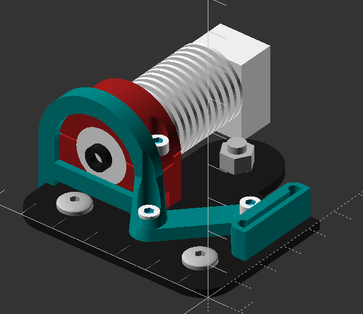
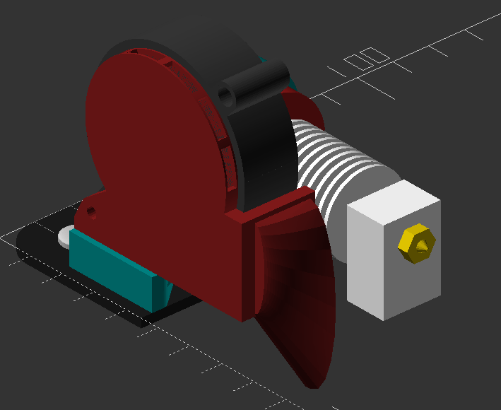

# hot-simple
Ender 3 Pro hot-end upgrade parts for E3D v6

*Designed in OpenScad*

## Overview

This hot-end design is still very much a work in progress but its intent is to be simple but easy to modify. While the design is still quite incomplete, it is functional and I have been using it for a while now, with great results. I will likely eventually post this to thingiverse.com, but haven't yet as it's still too incomplete.

### Current design
The design currently uses:
 - The hot-end fan and clamp that comes with the E3D
 - A 5015 part cooling fan [like these](https://www.amazon.com/gp/product/B07DB7DLMM/ref=ppx_yo_dt_b_search_asin_title?ie=UTF8&psc=1)

## hot-end u-clamp

####  Printing:
- Material: ProtoPasta HTPLA or PETG
- Infill: 100%
- Supports: Yes 

The clamp for the E3D mostly acts as an adapter, which slots over the two little pegs that hold the OEM hot-end:

Assembly requires four screws, two M3x5 and two M3x16, and two M3 nuts

The clamp fit is designed to be *very tight*. Because part of the inner collar on the U-part of the clamp has to be printed over support structure, the bottom surface tends to be a bit rough and thus makes the inner collar thickness larger than actually designed. I've taken a sharp blade and shaved that surface down until I can _just_ squeeze the U-part of the clamp all the way into the E3D collar. 

## accessory-backing

####  Printing:
- Material: ProtoPasta HTPLA
- Infill: 20%
- Supports: Yes 

The accessory backing piece only has one snap-in connector for the part cooling fan. The bit that wraps around the u-clamp actually serves no purpose at the moment but will eventually be updated to include a connector for a part cooling fan on the right side of the hot-end and a top connector for a hot-end shroud.

## left-hand 5015 fan hood

####  Printing:
- Material: ProtoPasta HTPLA
- Infill: 20%
- Supports: Yes 

This fan hood directs the intake of the fan to pull air from the cooler front of the printer and directs the output to spread across the left side in a generally rearward direction.
